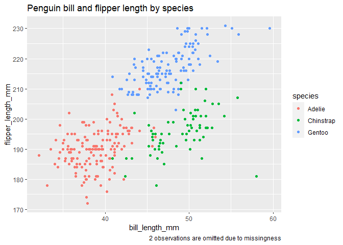

Homework 1
================
Safiya Sirota
2021-09-29

-   [Problem 1](#problem-1)
-   [Problem 2](#problem-2)

## Problem 1

**Creating a data frame:**

``` r
set.seed(11)

problem1_df <-
  tibble(
    vec_numeric = rnorm(10),
    vec_logical = vec_numeric > 0,
    vec_char = c("a","b","c","d","e","f","g","h","i","j"),
    vec_factor = as.factor(x = sample(1:3, 10, replace = TRUE))
  )
```

**Taking the mean of variables in `problem1_df`:**

``` r
mean(pull(problem1_df, vec_numeric))
```

    ## [1] -0.2300625

``` r
mean(pull(problem1_df, vec_logical))
```

    ## [1] 0.4

``` r
mean(pull(problem1_df, vec_char))
```

    ## [1] NA

``` r
mean(pull(problem1_df, vec_factor))
```

    ## [1] NA

It works to take the mean of the numeric and logical vectors. It doesn’t
work to take the mean of the character or factor variables. In fact, the
warning given when trying to take the mean of a character or factor
variable states that the argument is not numeric or logical, meaning the
variables *must* be numeric or logical to calculate a mean.

**Trying to convert variables to numeric type using `as.numeric`:**

``` r
as.numeric(pull(problem1_df, vec_logical))
as.numeric(pull(problem1_df, vec_char))
as.numeric(pull(problem1_df, vec_factor))
```

When we use the `as.numeric` function on the logical variable,
`vec_logical` gets converted to a binary variable where every value is
either a 0 (representing FALSE) or a 1 (representing TRUE). When we use
the `as.numeric` function on the character or factor variables, we get
NA.

When we take the mean of a logical variable, each T/F value is
automatically converted to 0 or 1, and we take the mean of this numeric
vector. We cannot compute the means of character or factor variables
because they have no automatic numeric conversion.

## Problem 2

**Loading penguins dataset:**

``` r
data("penguins", package = "palmerpenguins")
```

**Describing `penguins`:**

-   The variables in this dataset include:

    -   **species** (Adelie, Chinstrap, Gentoo),

    -   **island** (Biscoe, Dream, Torgersen),

    -   **some body measurements** (i.e., bill\_length\_mm,
        bill\_depth\_mm, flipper\_length\_mm, and body\_mass\_g),

    -   **sex** (female, male),

    -   and **year** (2007, 2008, 2009).

-   The dataset has 344 observations and 8 variables, which are all
    listed above.

-   The mean flipper length of penguins in this dataset is
    200.9152047 mm.

**Making a scatterplot:**

``` r
ggplot(penguins, aes(x = bill_length_mm, y = flipper_length_mm, color = species)) + geom_point() +
  labs(title = "Penguin bill and flipper length by species", 
       caption = "2 observations are omitted due to missingness")
```

<!-- -->
